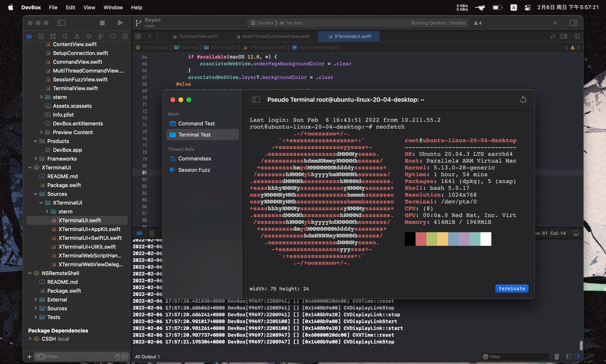

# XTerminalUI

xterm.js binding to AppleUI with WebKit.

## Preview



## Usage

We recommend to use this package with [https://github.com/Lakr233/NSRemoteShell](https://github.com/Lakr233/NSRemoteShell).

SwiftUI Example

```
GeometryReader { r in
    webView
        .setupBufferChain { dataBuffer.append($0) }
        .setupTitleChain { title = $0 }
        .onAppear {
            webView.loadTerminalPage()
        }
        .frame(width: r.size.width, height: r.size.height)
        .onAppear { updateTerminalSize() }
        .onChange(of: r.size) { _ in updateTerminalSize() }
}
```

## LICENSE

NSRemoteShell is licensed under [MIT License - Lakr's Edition].

```
Permissions
- Commercial use
- Modification
- Distribution
- Private use

Limitations
- NO Liability
- NO Warranty

Conditions
- NO Conditions
```

---

Copyright © 2022 Lakr Aream. All Rights Reserved.
